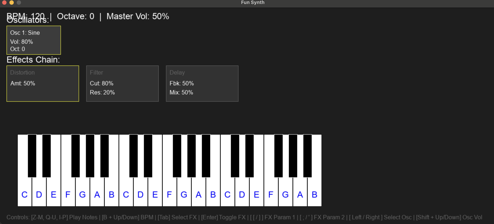

# Fun Synth

A modular, polyphonic software synthesizer written in C using SDL2.



## Features

*   **Modular Architecture**: Add and remove oscillators dynamically.
*   **Polyphonic**: Play multiple notes simultaneously (up to 10 voices).
*   **Multiple Waveforms**: Sine, Sawtooth, Square, and Triangle.
*   **Effects Chain**:
    *   **Distortion**: Add grit and overdrive.
    *   **Low Pass Filter**: Cutoff and Resonance controls.
    *   **Delay**: BPM-synced stereo delay with feedback.
*   **Interactive GUI**: Visual keyboard, oscillator list, and effects panel.
*   **Keyboard Control**: Play notes and control parameters entirely via keyboard.

## Controls

### Playing
*   **Z - M**: Lower Octave
*   **Q - U**: Middle Octave
*   **I - P**: Upper Octave

### Global
*   **B + Up/Down**: Change BPM
*   **Up/Down**: Change Octave

### Oscillators
*   **+ (Equals)**: Add a new Oscillator
*   **- (Minus)**: Remove the last Oscillator
*   **Left / Right Arrows**: Select an Oscillator
*   **Shift + Up/Down**: Change Volume of selected Oscillator
*   **1 - 4**: Change Waveform of selected Oscillator (Sine, Saw, Square, Triangle)

### Effects
*   **Tab**: Cycle through Effects (Distortion -> Filter -> Delay)
*   **Enter**: Toggle selected Effect On/Off
*   **[ / ]**: Adjust Parameter 1 (Amount / Cutoff / Feedback)
*   **; / '** : Adjust Parameter 2 (Resonance / Mix)

## Building

### Prerequisites
*   CMake
*   SDL2
*   SDL2_ttf

### Build Steps
```bash
mkdir build
cd build
cmake ..
make
```

### Running Tests
```bash
./run_tests
```

## License
This project is open source.
